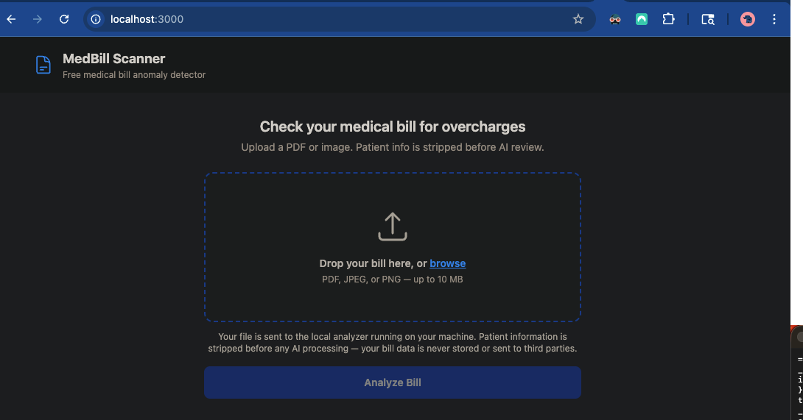
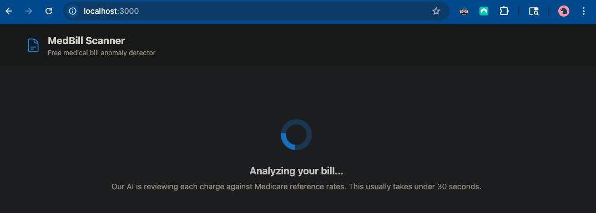
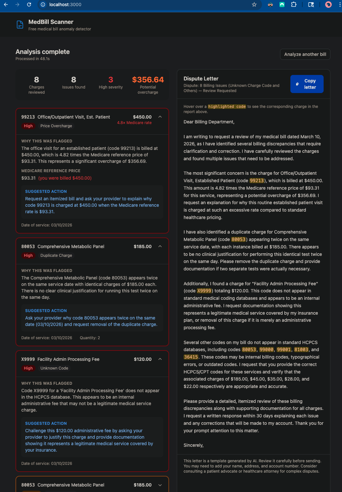

# MedBill Scanner


A free, open-source medical bill anomaly detector that helps patients identify potential overcharges and generate dispute letters.

**Free and open source — runs entirely on your machine. Your bill data never leaves.**

Medical billing errors are common. Studies estimate 80% of bills contain mistakes, yet most patients lack the tools to identify them. MedBill Scanner extracts charges from your bill, compares them against CMS Medicare reference prices, and flags anomalies — then generates a professional dispute letter you can send to your provider.

---

## ⚙️ How It Works


---

## 🖼 Screenshots

### Upload



*Drop a PDF or image of your bill — the app validates the file type by magic bytes before anything else runs.*

### Analysis in Progress



*OCR, PII redaction, and RAG retrieval all run locally. The Anthropic API is called only after redaction is verified.*

### Anomaly Report and Dispute Letter



*Flagged line items appear as severity-tiered cards on the left. The ready-to-send dispute letter is on the right. Hovering a code in the letter highlights the matching anomaly card.*

---

## ✨ Features

| Feature                          | Description                                                                                                              |
| -------------------------------- | ------------------------------------------------------------------------------------------------------------------------ |
| 📄 PDF & Image Support           | pdfplumber handles digital PDFs; pytesseract handles scanned images and photos                                           |
| 🔐 PII Stripped Before AI        | Regex-based redaction (SSN, DOB, names, insurance IDs, phone, email, address) with assertion check before every API call |
| 💰 Medicare Reference Pricing    | CMS HCPCS public data with RVU-based fair price estimates — no third-party pricing API                                   |
| 🔍 Five Anomaly Types            | `price_overcharge`, `duplicate_charge`, `unbundling`, `upcoding`, `unknown_code`                                         |
| 🎯 Severity Tiers                | HIGH (dispute immediately), MEDIUM (request clarification), LOW (worth reviewing), INFO                                  |
| 🤖 ReAct Agent Architecture      | Multi-turn reasoning loop with tool-based structured output — no brittle text parsing                                    |
| ✉️ Dispute Letter Generator      | Professional letter ready to send, references specific codes and dollar amounts, no PII                                  |
| 🔗 Cross-Highlighting            | Hover a code in the dispute letter to highlight the matching anomaly card                                                |
| 💾 Zero Patient Data Persistence | No database writes, no log persistence — data gone when the request completes                                            |

---

## 🛠 Tech Stack

| Layer          | Technologies                                  |
| -------------- | --------------------------------------------- |
| Backend API    | FastAPI, Python 3.11, uvicorn                 |
| AI / LLM       | Anthropic Claude (`claude-sonnet-4-20250514`) |
| Embeddings     | sentence-transformers (local, no API)         |
| Vector DB      | ChromaDB                                      |
| OCR            | pdfplumber (digital), pytesseract (scanned)   |
| PII detection  | Python stdlib `re` — no ML model              |
| Reference data | CMS HCPCS + RVU files (public domain)         |
| Rate limiting  | slowapi                                       |
| Frontend       | React 18, TypeScript, Tailwind CSS            |
| Serving        | nginx                                         |
| Infrastructure | Docker Compose                                |

---

## 🚀 Quickstart

### Prerequisites

- Docker and Docker Compose
- Python 3.11+ (for the one-time data download script)
- An Anthropic API key — get one at [console.anthropic.com](https://console.anthropic.com)

### Steps

```bash
# 1. Clone the repository
git clone https://github.com/your-username/medbill-scanner.git
cd medbill-scanner

# 2. Create your environment file
cp .env.example .env
```

Open `.env` and set two required values:

```
ANTHROPIC_API_KEY=your_key_here
MEDBILL_PROJECT_ROOT=/absolute/path/to/medbill-scanner
```

```bash
# 3. Create the data directories Docker expects
mkdir -p docker/chroma_data
mkdir -p data/raw
mkdir -p data/processed

# 4. Download CMS reference data (one-time, ~50 MB)
#    Downloads HCPCS and RVU files from cms.gov
pipenv install 
pipenv run python3 download_cms_data.py

# 5. Build and start all services
docker compose up --build

# 6. Load CMS data into ChromaDB (one-time, run after services are up)
#    Wait for "Application startup complete" in the backend logs first
docker compose run --rm backend python backend/rag/ingest.py

# 7. Open the app
open http://localhost:3000
```

The frontend health check will show a warning banner if ChromaDB is not yet loaded. If you see it, step 6 has not completed yet.

### Sample Bills for Testing

Sample medical bills are available in `docs/test_bill/` — both a PDF (`test_bill.pdf`) and a JPEG (`test_bill.jpg`) version of the same bill. Upload either file on the first run to confirm the full pipeline is working end to end before testing with a real bill.

### Stopping

```bash
docker compose down
```

CMS reference data in `docker/chroma_data/` persists between runs. You do not need to re-run `ingest` unless you delete that directory.

---

## 🔒 Security

Security was designed in from the start — not added afterward. Key properties:

### Data handling

- **PII redaction before every API call** — `assert_no_pii_leak()` re-runs all patterns on the redacted text and blocks the API call if any PII pattern still matches
- **No patient data persistence** — bill text lives in memory for one HTTP request only; never written to disk, never logged
- **CMS reference data only in ChromaDB** — the vector database contains public government data, not patient information

### Application

- File uploads validated by magic bytes (not just extension) via `python-magic`
- Files over 10 MB rejected; only PDF, JPEG, PNG accepted (HTTP 415 otherwise)
- Rate limiting: 10 requests per minute per IP via slowapi
- CORS locked to `FRONTEND_URL` env var — never wildcard `*`
- All config via environment variables — no secrets in code

### Container hardening (configured in `docker-compose.yml`)

- Non-root user (uid 1000) in all containers
- Read-only root filesystem — immutable at runtime; attackers cannot install tools
- `no-new-privileges` — prevents privilege escalation via setuid binaries
- All Linux capabilities dropped (`cap_drop: ALL`, nothing added back)
- `/tmp` is a tmpfs RAM mount, capped at 100 MB — never touches disk
- Memory limited to 512 MB per container
- PID limit of 100 — prevents fork bombs
- Two isolated Docker networks:
  - `medbill-internal` — backend ↔ ChromaDB only, no internet access
  - `medbill-external` — frontend ↔ backend, backend → Anthropic API
- ChromaDB has zero internet access; frontend cannot reach it directly
- All ports bound to `127.0.0.1` — not reachable from other machines on your network

---

## 📁 Project Structure

```
medbill-scanner/
├── backend/                  FastAPI application
│   ├── api/                  HTTP routes, Pydantic models, middleware
│   ├── agent/                ReAct agent (multi-turn LLM loop)
│   ├── rag/                  ChromaDB ingest and retriever
│   └── services/             OCR, PII redaction, anomaly detection, dispute generation
├── frontend/                 React 18 + TypeScript + Tailwind CSS
│   └── src/
│       ├── components/       BillUploader, AnomalyReport, DisputeLetter, LoadingSpinner
│       ├── hooks/            useBillAnalysis (data fetching)
│       └── utils/            API client
├── scripts/
│   └── download_cms_data.py  One-time CMS HCPCS + RVU download
├── docker-compose.yml        Three-service stack with security hardening
└── .env.example              All configuration documented
```

Runtime data directories (gitignored, created manually before first run):

```
data/
├── raw/                      Downloaded CMS ZIP files
└── processed/                Cleaned CSVs ready for ChromaDB ingest
docker/
└── chroma_data/              ChromaDB persistence (CMS reference data only)
```

---

## ⚙️ Environment Variables

See `.env.example` for the full list with comments. Required variables:

| Variable               | Description                                                     |
| ---------------------- | --------------------------------------------------------------- |
| `ANTHROPIC_API_KEY`    | Your Anthropic API key                                          |
| `MEDBILL_PROJECT_ROOT` | Absolute path to this directory (used for Docker volume mounts) |

Optional variables with defaults:

| Variable                | Default                 | Description                                    |
| ----------------------- | ----------------------- | ---------------------------------------------- |
| `RAG_TOP_K`             | `5`                     | Number of HCPCS results returned per RAG query |
| `MAX_UPLOAD_SIZE_MB`    | `10`                    | Maximum file size for uploads                  |
| `RATE_LIMIT_PER_MINUTE` | `10`                    | API rate limit per IP                          |
| `FRONTEND_URL`          | `http://localhost:3000` | CORS allowed origin                            |

---

## 📡 API Reference

### `POST /api/analyze`

Upload a bill for analysis. Accepts `multipart/form-data` with a `file` field.

**Response** (`200 OK`):

```json
{
  "anomalies": [
    {
      "line_item": {
        "code": "99213",
        "description": "Office visit, established patient",
        "quantity": 1,
        "billed_amount": 450.0,
        "service_date": "01/15/2025"
      },
      "anomaly_type": "price_overcharge",
      "severity": "high",
      "explanation": "Code 99213 was billed at $450.00, which is 4.1x the Medicare reference rate of $109.97.",
      "medicare_reference_price": 109.97,
      "overcharge_ratio": 4.09,
      "suggested_action": "Request an itemized bill and ask your provider to explain the charge for code 99213."
    }
  ],
  "dispute_letter": {
    "subject_line": "Formal Dispute of Billing Charges",
    "body": "Dear Billing Department, ...",
    "anomaly_codes": ["99213"]
  },
  "bill_summary": {
    "total_line_items": 8,
    "total_billed_amount": 1842.0,
    "anomaly_count": 2,
    "high_severity_count": 1,
    "medium_severity_count": 1,
    "potential_overcharge_total": 340.03
  },
  "processing_time_seconds": 12.4
}
```

**Error responses**: `400` invalid request, `413` file too large, `415` unsupported file type, `429` rate limit exceeded, `500` analysis failed.

### `GET /api/health`

Returns backend and ChromaDB status.

```json
{
  "status": "ok",
  "chromadb_connected": true,
  "collection_size": 9432
}
```

`status` values: `"ok"` (ready), `"degraded"` (ChromaDB up but ingest not run), `"unavailable"` (ChromaDB unreachable).

---

## 💲 How Medicare Reference Prices Are Calculated

CMS publishes Relative Value Units (RVUs) for each HCPCS procedure code. A Medicare reference price is calculated as:

```
Medicare Reference Price = Total RVU × $32.74
```

The $32.74 figure is the 2025 CMS Physician Fee Schedule conversion factor — a public, government-set value updated annually. This gives a defensible baseline for price comparisons. It is not the only valid price (facility fees, geographic adjustments, and payer contracts all affect actual rates), but charges significantly above this baseline are worth questioning.

---

## ⚠️ Limitations

- Accuracy depends on OCR quality. Poorly scanned bills with low contrast or skewed pages may produce incomplete text extraction.
- PII redaction uses regex patterns. It covers common US medical bill formats (UB-04, CMS-1500). Unusual formatting may not be caught. The `assert_no_pii_leak()` check is a second pass but is not a substitute for human review before sharing results.
- Medicare reference prices are a baseline, not a ceiling. Providers may legitimately bill above Medicare rates based on geography, facility type, and payer contracts.
- The agent reasons about what it can see in the redacted text. Line items with no HCPCS code and no close semantic match may be missed.

---

## 📋 Disclaimer

This tool identifies potential billing anomalies for informational purposes only. It is not legal or medical advice. Review generated letters carefully before sending. Consult a patient advocate or healthcare attorney for complex disputes.

---

## 👥 Maintainers

| Name                   | Role                                                       | Profile                                          |
| ---------------------- | ---------------------------------------------------------- | ------------------------------------------------ |
| **Akshay K**           | Creator & Lead Engineer — Senior SWE, AI engineering focus | [@akshayreddyy](https://github.com/akshayreddyy) |
| **Claude (Anthropic)** | AI Pair Programmer — `claude-sonnet-4-6`                   | [Anthropic](https://anthropic.com)               |

---

## 📄 License

MIT

---
